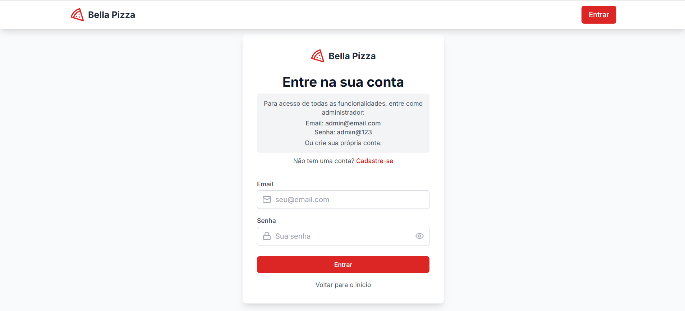
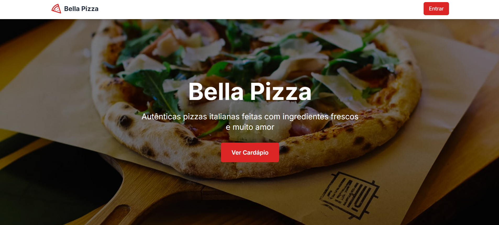
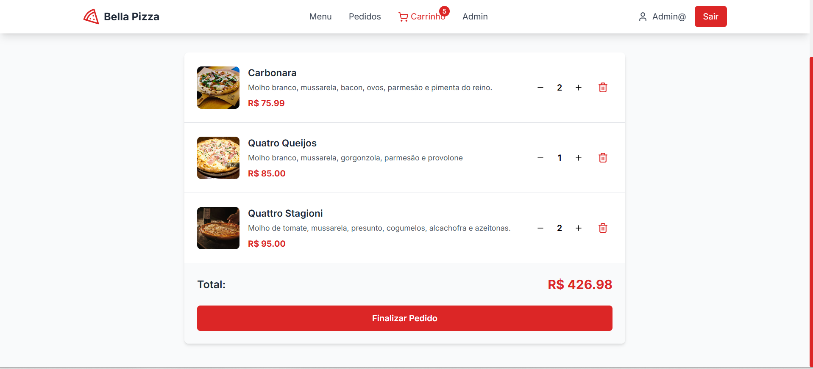
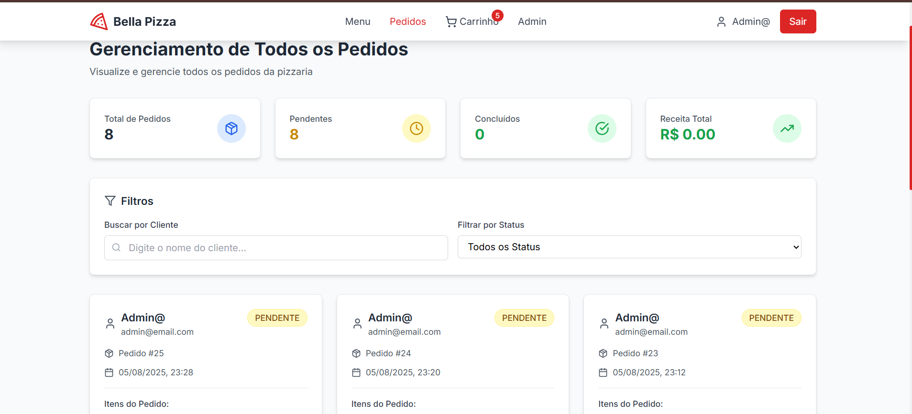
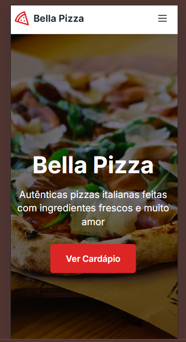
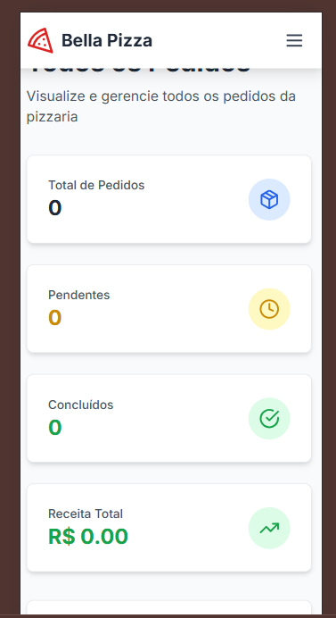
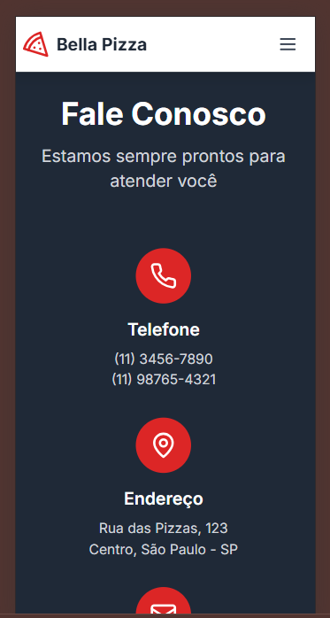

# Pizzaria - Aplicação Full Stack

Esta é uma aplicação full stack com React (frontend), Django (backend), PostgreSQL (banco de dados) e Nginx (servidor web).

## 🖥️ Demonstração Visual

### Desktop 

<div style="display: flex; gap: 20px; justify-content: center; flex-wrap: wrap; margin-bottom: 40px;">

<div style="text-align: center;">
<h4>🔐 Login</h4>

<p style="margin-top: 10px; color: #666; font-size: 14px;">Tela de autenticação</p>
</div>

<div style="text-align: center;">
<h4>🏠 Página Inicial</h4>

<p style="margin-top: 10px; color: #666; font-size: 14px;">Interface principal da aplicação</p>
</div>

<div style="text-align: center;">
<h4>🛒 Carrinho</h4>

<p style="margin-top: 10px; color: #666; font-size: 14px;">Sistema de carrinho de compras</p>
</div>

<div style="text-align: center;">
<h4>⚙️ Gerência de Pedidos</h4>

<p style="margin-top: 10px; color: #666; font-size: 14px;">Painel administrativo</p>
</div>

</div>

### 📱 Mobile - Design Responsivo

<div style="display: flex; gap: 15px; justify-content: center; flex-wrap: wrap;">

<div style="text-align: center;">
<h4>📱 Página Inicial Mobile</h4>

<p style="margin-top: 8px; color: #666; font-size: 12px;">Versão mobile otimizada</p>
</div>

<div style="text-align: center;">
<h4>📱 Pedido Mobile</h4>

<p style="margin-top: 8px; color: #666; font-size: 12px;">Pedidos no mobile</p>
</div>

<div style="text-align: center;">
<h4>📱 Informações Mobile</h4>

<p style="margin-top: 8px; color: #666; font-size: 12px;">Contatos</p>
</div>

</div>

## Arquitetura

- **Frontend**: React com Vite, gera arquivos estáticos
- **Backend**: Django com Gunicorn
- **Banco de Dados**: PostgreSQL
- **Servidor Web**: Nginx (serve arquivos estáticos e faz proxy para API)

## Configuração

### 1. Variáveis de Ambiente

Crie um arquivo `.env` na raiz do projeto com as seguintes variáveis:

**Opção 1: Copiar do arquivo de exemplo**
```bash
cp env.example .env
```

**Opção 2: Criar manualmente**

```env
# PostgreSQL Database Configuration
POSTGRES_DB=pizzaria_db
POSTGRES_USER=pizzaria_user
POSTGRES_PASSWORD=pizzaria_password
POSTGRES_HOST=db
POSTGRES_PORT=5432

# Django Configuration
DJANGO_SUPERUSER_USERNAME=admin
DJANGO_SUPERUSER_EMAIL=admin@email.com
DJANGO_SUPERUSER_PASSWORD=admin@123
SECRET_KEY=your-secret-key-here
DEBUG=True
ALLOWED_HOSTS=localhost,127.0.0.1

# API Configuration
API_URL=http://localhost/api
```

### 2. Executar a Aplicação

#### Opção 1: Usando Scripts (Recomendado)

**No WSL:**
```bash
# Tornar o script executável (apenas na primeira vez)
chmod +x start.sh

# Executar o script
./start.sh
```

**No Windows PowerShell:**
```powershell
# Executar o script PowerShell
.\start.ps1
```

#### Opção 2: Comandos Manuais

```bash
# Construir e iniciar todos os serviços
docker-compose up --build

# Executar em background
docker-compose up -d --build
```

### 3. Acessos

- **Frontend**: http://localhost
- **API Django**: http://localhost/api
- **Admin Django**: http://localhost/admin
- **Banco de Dados**: localhost:5432

## Estrutura dos Serviços

### Frontend (React)
- Gera build estático com `npm run build`
- Arquivos servidos pelo Nginx
- Porta: 80 (via Nginx)

### Backend (Django)
- Roda com Gunicorn
- API REST em `/api/`
- Admin em `/admin/`
- Porta: 8000 (interno)

### Nginx
- Serve arquivos estáticos do React
- Proxy para API Django
- Cache para arquivos estáticos
- Porta: 80

### PostgreSQL
- Banco de dados principal
- Porta: 5432
- Health check configurado

## Volumes

- `postgres_data`: Dados do PostgreSQL
- `static_volume`: Arquivos estáticos do Django
- `media_volume`: Arquivos de mídia do Django

## Comandos Úteis

```bash
# Ver logs
docker-compose logs -f

# Parar serviços
docker-compose down

# Reconstruir um serviço específico
docker-compose up --build backend

# Acessar container
docker-compose exec backend bash
docker-compose exec db psql -U pizzaria_user -d pizzaria_db
```

## Desenvolvimento

### Configuração para WSL

Se você está usando WSL (Windows Subsystem for Linux):

1. **Instale o Docker Desktop no Windows**
2. **Configure o Docker para usar WSL 2**
3. **Certifique-se de que o Docker Desktop está rodando**
4. **No WSL, navegue até o diretório do projeto**

### Passos para Desenvolvimento

1. Clone o repositório
2. Configure o arquivo `.env` (veja exemplo acima)
3. Execute um dos scripts de inicialização:
   - **WSL**: `./start.sh`
   - **Windows PowerShell**: `.\start.ps1`
   - **Comandos manuais**: `docker-compose up --build`

4. Acesse a aplicação:
   - Frontend: http://localhost
   - API: http://localhost/api
   - Admin: http://localhost/admin

5. Para desenvolvimento local:
   - Frontend: Execute `npm install` e `npm run dev` na pasta `frontend/`
   - Backend: Execute `python manage.py runserver` na pasta `backend/`